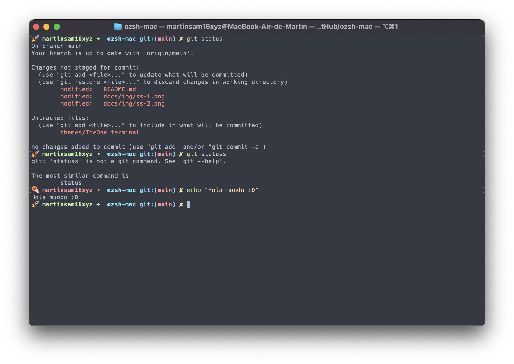
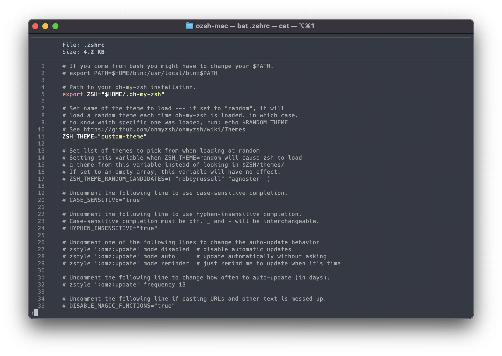

# Config ozsh/terminal on Mac M1

## Requirements

- Ozsh
- Terminal

## Customize

```sh
# Install required fonts
brew tap homebrew/cask-fonts
brew install font-hack-nerd-font --cask
# Install ls with steroids
brew install lsd
# Install cat with steroids
brew install bat
```

## Import Theme

1. Go to *Terminal > Preferences > Profiles > Import Profile*
2. Select one theme of *themes/**.terminal*
   1. The One
   2. One Dark
   3. One Light
3. Go to *Terminal > General* and set default profile from themes imported

## Configuration

```sh
## Set zsh as default shell
sudo sh -c "echo $(which zsh) >> /etc/shells"
chsh -s $(which zsh)

## Copy custom-theme
cp themes/custom-theme.zsh-theme ~/.oh-my-zsh/themes
cp .zshrc ~/.zshrc

## Refresh ozsh
source ~/.zshrc
```

## Fixing the font in IDEs

```properties
# vscode
"terminal.integrated.fontFamily": "Hack Nerd Font"
```


## Screenshots





